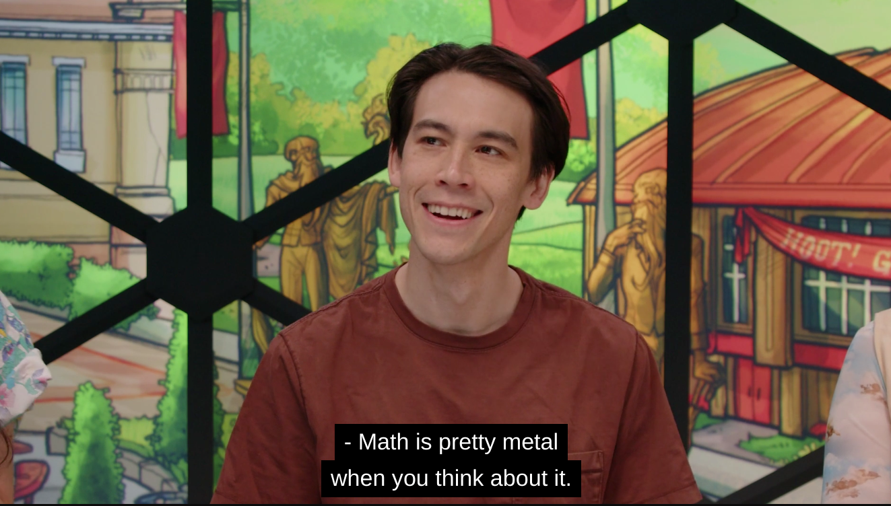
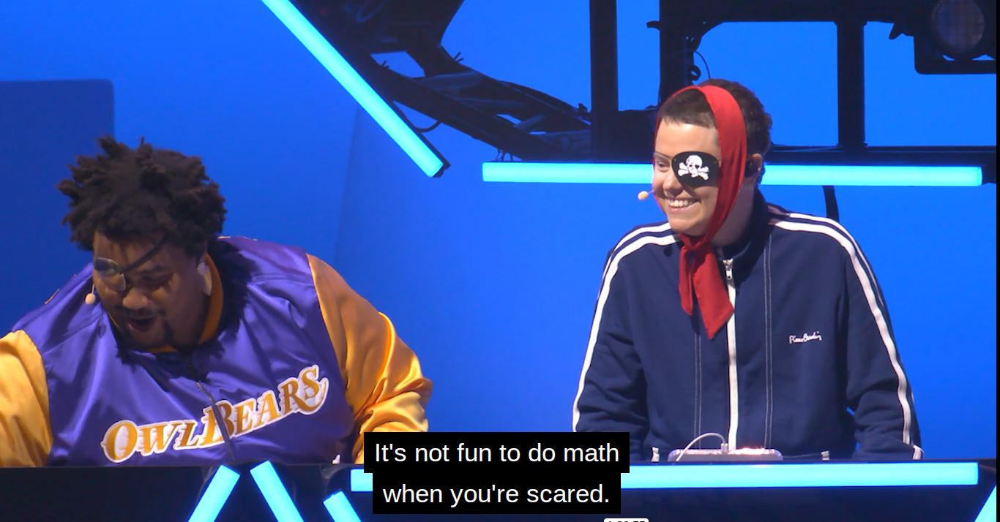
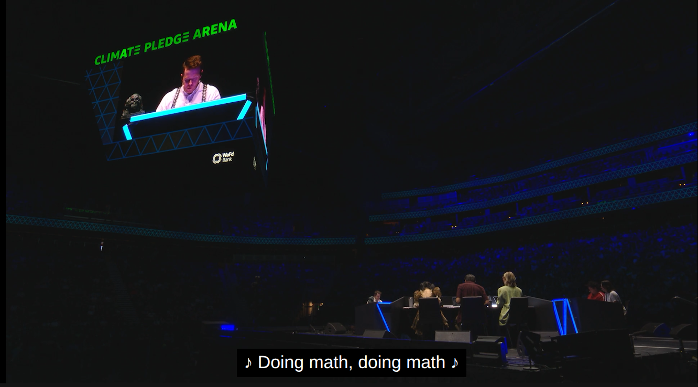
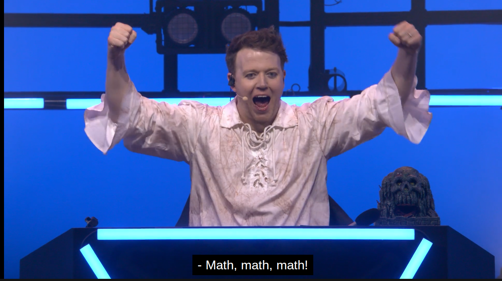
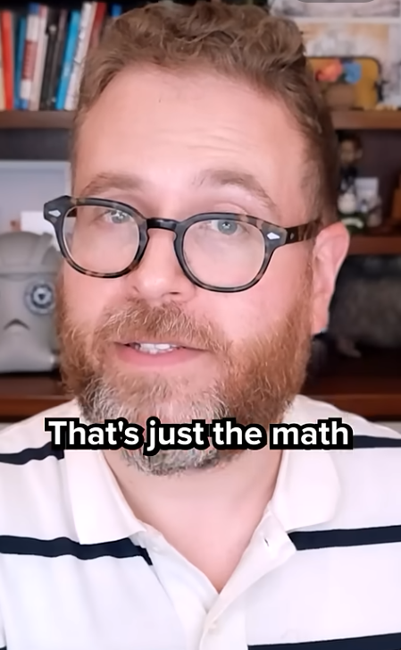

Wow, it feels good to update again. My idea drawer is not so full. Meaning this blog hasn't had new content. I've also
started a website that [feautres only my cross stitch stuff](https://suzzastitches.com). That is taking up my time as well.

The post though is about math memes. Dimesion 20 keeps brining memeable moments that I screen cap. I have a large
enough collection now to share them with you. Dimension 20 is the Tabletop RPG actual play on Dropout. There are always
jokes about [dice and mathematics](/10-videos-secrets-of-dice).

I know a lot of people who come to this blog are in math communications.
I hope that you can use some of these images in your presentations. They are taken out of context but I don't think
that matters much to get the humor and good feelings from them. But, [you should check out Dropout.tv](https://dropout.tv) for the comedy
and improv it offers. Great entertainment.

Of course, all images are copyright and owned by Dropout.

## Top 5 Math Memes from Dimension 20

### 1. Math is Metal When You Think About it

In this image from Fantasy High: Junior Year. Zac Oyama plays a Barbarian Artificer named Gorgug. In this moment
he is describing how he used mathematics to pull off an awesome move.

### 2. It's Not Fun To Do Math When You're Scared

This image encapsulates the [feeling of Math Anxiety](/a-writers-illicit-love-affair-with-mathematics). This is
taken from the sold out show at the Hollywood Bowl in Los Angeles. Lou Wilson plays Fabian Seacaster who is fighiting
his friends who are transfromed into pirates. This happens as he fights his nemesis Chungledown Bim. In this moment he is counting
up the total of his dice. Ally Beardsly as Kristen Applebees sits next to Lou in pirate costume. These characters are
from the Fantasy High Setting.

### 3. Doing Math

Game Master Brennan Lee Mulligan sings this as he is counting up dice. This is from the Time Quangle episode
filmed in Seattle.

### 4. This is a Show About Math

This moment appears in the Titan Takedown season of Dimension 20. Breenan Lee Mulligan says this offhandedly during
the game.

### 5. Math! Math! Math!

I saved my favorite for last. This image is also from the Hollywood Bowl. Imagine [almost 18,000 people](https://en.wikipedia.org/wiki/Hollywood_Bowl) chanting "Math!" in
unison. Beautiful.

## Bonus

### That's Just the Math

This appeared in a recent social media promotion featuring Sam Reich the CEO of Dropout.

Which meme is your favorite?
